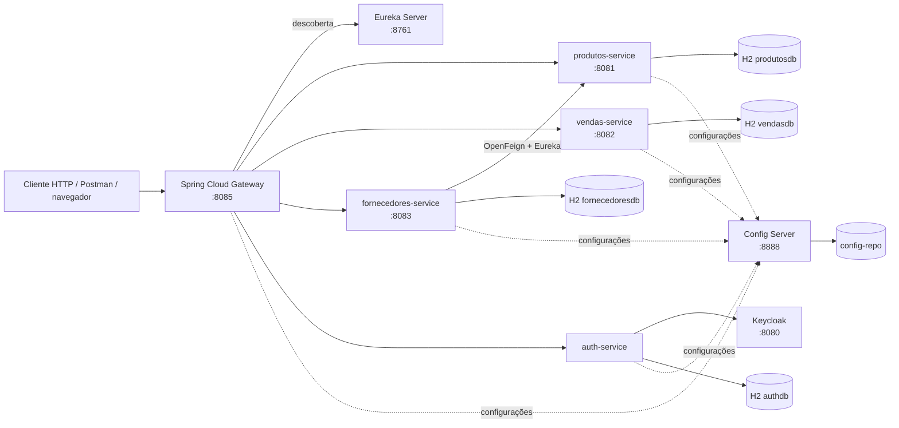
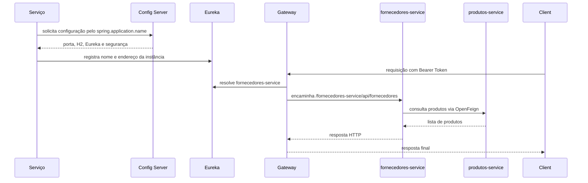
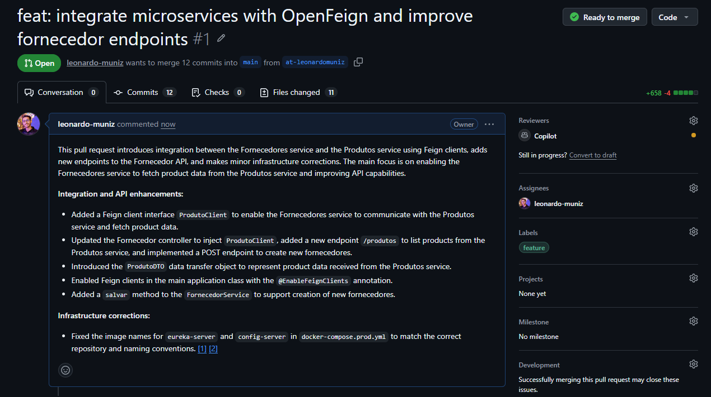
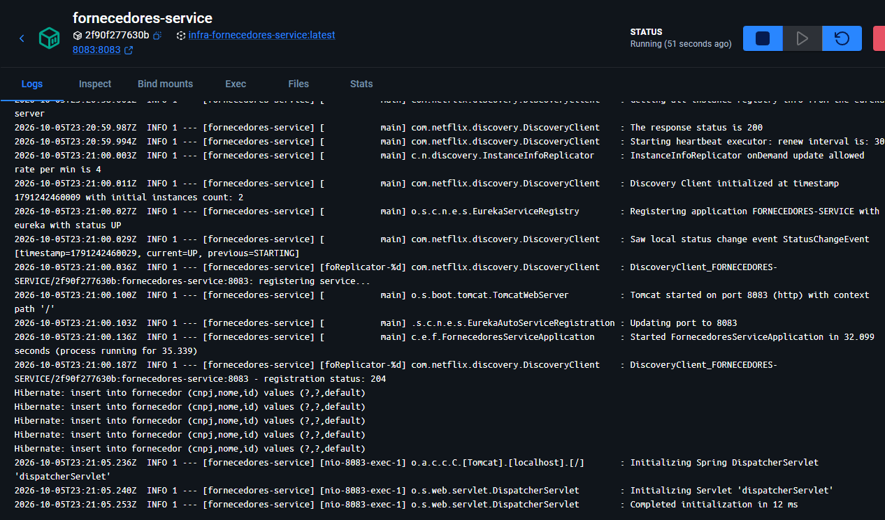
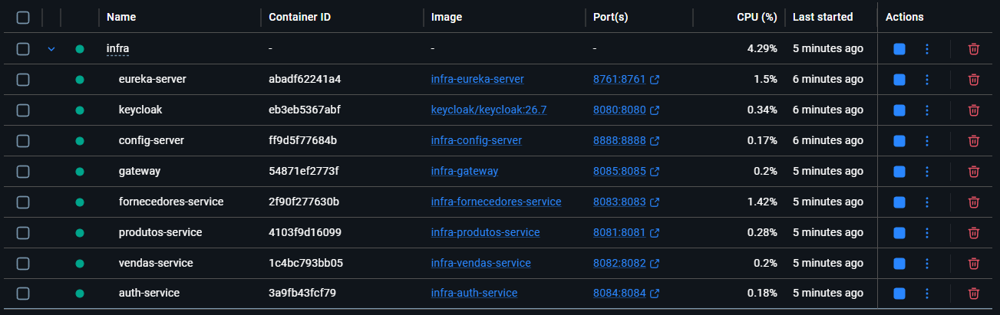
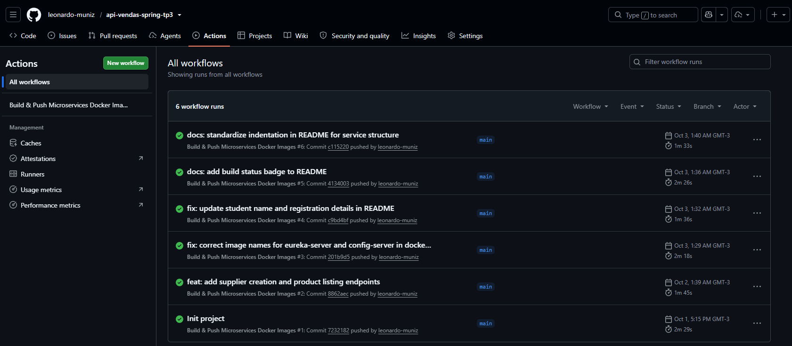

# API de Vendas — Microsserviços com Spring Boot e Spring Cloud

## Identificação acadêmica

| Campo | Informação |
|---|---|
| Nome completo | **Leonardo da Conceição Muniz** |
| Disciplina | Microsserviços e DevOps com Spring Boot e Spring Cloud |
| Branch da atividade | `main` |

> Este README reúne a descrição técnica do projeto e o roteiro das evidências solicitadas no Assessment. Os marcadores de imagem devem ser substituídos pelos prints reais obtidos durante a execução. Não devem ser utilizados prints simulados.

## 1. Visão geral

Este projeto implementa uma plataforma de comércio eletrônico organizada em microsserviços. Cada serviço possui uma responsabilidade delimitada, registra-se no Eureka e recebe suas configurações do Config Server. O Gateway concentra o acesso externo, enquanto a comunicação entre serviços pode ser feita por descoberta de serviço e por Spring Cloud OpenFeign.

O microsserviço desenvolvido para a atividade é o `fornecedores-service`. Ele mantém fornecedores em um banco H2 em memória, disponibiliza operações de consulta e cadastro, consulta produtos por Feign e pode ser executado localmente, em Docker Compose ou em Kubernetes.

### Objetivos atendidos

- criar e registrar o `fornecedores-service` na arquitetura existente;
- persistir fornecedores com nome obrigatório e CNPJ obrigatório e único;
- inicializar cinco registros de teste no H2;
- disponibilizar consulta, busca por identificador e cadastro;
- externalizar configurações para o Config Server;
- publicar o serviço por meio do Spring Cloud Gateway;
- integrar `fornecedores-service` e `produtos-service` com OpenFeign;
- executar a infraestrutura com Docker Compose;
- automatizar build e publicação de imagens pelo GitHub Actions;
- disponibilizar manifests para execução em Kubernetes.

## 2. Tecnologias e linguagens utilizadas

| Categoria | Tecnologia |
|---|---|
| Linguagem | Java |
| Plataforma | Java configurado no projeto como `25` em cada `pom.xml` |
| Framework principal | Spring Boot `4.1.1` |
| Ecossistema cloud | Spring Cloud `2025.1.3` |
| APIs HTTP | Spring MVC e Spring WebFlux no Gateway |
| Persistência | Spring Data JPA, Hibernate e H2 em memória |
| Descoberta de serviços | Spring Cloud Netflix Eureka |
| Configuração centralizada | Spring Cloud Config Server |
| Comunicação entre serviços | Spring Cloud OpenFeign |
| Segurança | OAuth2 Resource Server, JWT e Keycloak |
| Gateway | Spring Cloud Gateway |
| Validação e produtividade | Bean Validation e Lombok |
| Empacotamento | Maven e Spring Boot Maven Plugin |
| Conteinerização | Docker e Docker Compose |
| Orquestração | Kubernetes e manifests declarativos |
| Integração contínua | GitHub Actions |
| Versionamento | Git e GitHub |

> O enunciado do Assessment menciona Java 17, mas o estado atual deste repositório declara Java 25 no Maven e no workflow. Essa divergência deve ser alinhada com a exigência da disciplina antes da entrega, caso o ambiente avaliador exija especificamente o JDK 17.

## 3. Arquitetura da solução

### 3.1 Componentes

- **Eureka Server (`8761`)**: catálogo de instâncias disponíveis.
- **Config Server (`8888`)**: fornece as configurações armazenadas em `config-repo`.
- **Gateway (`8085`)**: ponto de entrada HTTP e validação de tokens JWT.
- **Produtos Service (`8081`)**: consulta de produtos.
- **Vendas Service (`8082`)**: registro e consulta do fluxo de vendas.
- **Fornecedores Service (`8083`)**: cadastro, consulta e integração com produtos.
- **Auth Service (`8084`, conforme configuração atual)**: autenticação, usuários e integração administrativa com Keycloak.
- **Keycloak (`8080`, infraestrutura)**: emissor e validador de tokens OAuth2/JWT.

### 3.2 Diagrama de arquitetura



### 3.3 Fluxo de inicialização e requisição



## 4. Estrutura do projeto

```text
.
├── auth-service/                 # autenticação, usuários e Keycloak
├── config-repo/                  # propriedades centralizadas por serviço
├── config-server/                # servidor de configuração
├── eureka-server/                # descoberta de serviços
├── fornecedores-service/         # microsserviço desenvolvido na atividade
│   └── src/
│       ├── main/java/.../
│       │   ├── client/            # cliente Feign para produtos
│       │   ├── config/            # carga inicial e segurança
│       │   ├── controller/        # endpoints REST
│       │   ├── dto/               # objetos de transferência
│       │   ├── model/             # entidade Fornecedor
│       │   ├── repository/        # acesso ao H2
│       │   └── service/            # regras de negócio
│       └── test/                   # testes automatizados
├── gateway/                      # entrada HTTP e segurança reativa
├── produtos-service/             # catálogo de produtos
├── vendas-service/               # vendas
├── infra/
│   ├── docker-compose.yml        # execução integrada local
│   ├── docker-compose.prod.yml   # composição para produção
│   ├── keycloak/                 # realm exportado
│   └── k8s/                      # Namespace, Deployments e Services
├── .github/workflows/            # automações do GitHub Actions
└── README.md
```

## 5. Endpoints do `fornecedores-service`

Os controllers do serviço estão sob o prefixo `/api/fornecedores`. Quando o acesso passa pelo Gateway com descoberta dinâmica, o identificador do serviço aparece antes do caminho.

| Método | Acesso direto | Acesso pelo Gateway | Resultado |
|---|---|---|---|
| `GET` | `http://localhost:8083/api/fornecedores` | `http://localhost:8085/fornecedores-service/api/fornecedores` | lista todos |
| `GET` | `http://localhost:8083/api/fornecedores/{id}` | `http://localhost:8085/fornecedores-service/api/fornecedores/{id}` | fornecedor ou `404` |
| `POST` | `http://localhost:8083/api/fornecedores` | `http://localhost:8085/fornecedores-service/api/fornecedores` | cria e retorna `201` |
| `GET` | `http://localhost:8083/api/fornecedores/produtos` | `http://localhost:8085/fornecedores-service/api/fornecedores/produtos` | produtos via Feign |

Exemplo de cadastro:

```json
{
  "nome": "Fornecedor de Exemplo Ltda",
  "cnpj": "12.345.678/0001-95"
}
```

## 6. Autenticação e proteção da API

Os endpoints de negócio são protegidos por OAuth2 Resource Server. O Gateway valida o token JWT usando as chaves públicas do Keycloak, e os microsserviços também validam o emissor configurado. Portanto, uma requisição sem credenciais ou com token inválido não deve ser considerada um acesso válido à API.

### 6.1 Obtendo o Bearer token

O `auth-service` disponibiliza o endpoint `POST /api/auth/login`, que encaminha as credenciais ao Keycloak e devolve um `accessToken`, um `refreshToken`, o tipo do token e o tempo de expiração. Pelo Gateway, o endereço recomendado é:

```text
http://localhost:8085/auth-service/api/auth/login
```

Exemplo de login:

```bash
curl -X POST http://localhost:8085/auth-service/api/auth/login \
  -H "Content-Type: application/json" \
  -d '{"email":"usuario@exemplo.com","senha":"sua-senha"}'
```

Resposta esperada, com valores ilustrativos:

```json
{
  "accessToken": "<ACCESS_TOKEN>",
  "refreshToken": "<REFRESH_TOKEN>",
  "tokenType": "Bearer",
  "expiresIn": 300
}
```

O valor de `accessToken` deve ser enviado no cabeçalho de todas as chamadas protegidas:

```bash
curl http://localhost:8085/fornecedores-service/api/fornecedores \
  -H "Authorization: Bearer <ACCESS_TOKEN>"
```

O endpoint de login e o endpoint de renovação são públicos para permitir a obtenção das credenciais. Os endpoints de negócio, como fornecedores, produtos e vendas, exigem o cabeçalho `Authorization` com um Bearer token válido.

### 6.2 Renovação do token

O `accessToken` pode ser renovado pelo endpoint `POST /api/auth/refresh` usando o `refreshToken` retornado no login. A renovação deve ser realizada dentro da janela de validade de **300 segundos**. Depois desse prazo, o refresh não deve ser tratado como garantido: é necessário realizar o login novamente para obter um novo par de tokens.

```bash
curl -X POST http://localhost:8085/auth-service/api/auth/refresh \
  -H "Content-Type: application/json" \
  -d '{
    "refreshToken":"<REFRESH_TOKEN>"
  }'
```

A resposta de refresh possui o mesmo formato do login. Sempre substitua o `accessToken` antigo pelo novo valor retornado antes de realizar novas requisições. Se o refresh retornar `401 Unauthorized`, faça login novamente.

> Nunca versione tokens, senhas, client secrets ou qualquer outra credencial. Os valores exibidos acima são placeholders e devem ser substituídos somente no ambiente de execução.

## 7. Como executar localmente

### 7.1 Pré-requisitos

- Git;
- JDK compatível com a versão declarada nos `pom.xml`;
- Maven (ou Maven Wrapper);
- Docker e Docker Compose;
- conta no GitHub para fork, branch, Pull Request e Actions;
- opcionalmente `kubectl` e `kind` para a execução em Kubernetes.

### 7.2 Execução integrada com Docker Compose

Na raiz do repositório:

```bash
docker compose -f infra/docker-compose.yml up --build
```

Verifique os containers:

```bash
docker compose -f infra/docker-compose.yml ps
```

Depois, consulte o serviço pelo Gateway:

```bash
curl http://localhost:8085/fornecedores-service/api/fornecedores
curl http://localhost:8085/fornecedores-service/api/fornecedores/produtos
```

Para encerrar:

```bash
docker compose -f infra/docker-compose.yml down
```

### 7.3 Execução com imagens publicadas pelo GitHub Actions

O arquivo [docker-compose.prod.yml](./infra/docker-compose.prod.yml) permite executar a plataforma usando as imagens publicadas pelo GitHub Actions no GitHub Container Registry (GHCR). Essa opção não constrói os serviços localmente e, portanto, é adequada para testar o sistema sem baixar o código-fonte completo de cada microsserviço.

O Compose de produção utiliza a variável `OWNER` para montar os nomes das imagens. Defina-a com o proprietário do repositório no GitHub:

```bash
export OWNER=seu-usuario-github
```

No PowerShell:

```powershell
$env:OWNER = "seu-usuario-github"
```

Se os pacotes do GHCR forem privados, autentique o Docker antes de iniciar os containers:

```bash
echo $GITHUB_TOKEN | docker login ghcr.io -u seu-usuario-github --password-stdin
```

Em seguida, suba a infraestrutura utilizando as imagens publicadas:

```bash
docker compose -f infra/docker-compose.prod.yml pull
docker compose -f infra/docker-compose.prod.yml up -d
docker compose -f infra/docker-compose.prod.yml ps
```

O acesso funcional continua sendo feito pelo Gateway:

```bash
curl http://localhost:8085/fornecedores-service/api/fornecedores
curl http://localhost:8085/fornecedores-service/api/fornecedores/produtos
```

Para acompanhar os logs:

```bash
docker compose -f infra/docker-compose.prod.yml logs -f gateway fornecedores-service
```

Para encerrar a execução:

```bash
docker compose -f infra/docker-compose.prod.yml down
```

Essa modalidade pressupõe que o workflow tenha publicado as imagens correspondentes no GHCR e que a versão desejada esteja identificada pela tag configurada no Compose. Em ambientes reais, é recomendável substituir `latest` por tags imutáveis associadas ao commit ou a uma versão de release.

### 7.4 Execução de um serviço com Maven

```bash
cd fornecedores-service
./mvnw spring-boot:run
```

No Windows:

```powershell
cd fornecedores-service
.\mvnw.cmd spring-boot:run
```

O serviço depende do Config Server para receber a configuração centralizada. Em uma execução completa, inicie primeiro o Eureka e o Config Server, depois os serviços de negócio e o Gateway.

## 8. Configuração centralizada

O arquivo local [application.properties](./fornecedores-service/src/main/resources/application.properties) mantém apenas o nome da aplicação e a URL do Config Server. As configurações de porta, H2, Eureka e OAuth2 ficam em:

- [fornecedores-service.properties](./config-repo/fornecedores-service.properties);
- [fornecedores-service-docker.properties](./config-repo/fornecedores-service-docker.properties).

Consulta direta ao Config Server:

```text
http://localhost:8888/fornecedores-service/default
http://localhost:8888/fornecedores-service/docker
```

## 9. Evidências solicitadas no Assessment

Crie uma pasta para os arquivos, por exemplo `docs/evidencias/`, e substitua os marcadores abaixo pelos prints reais. Cada imagem deve mostrar a URL, o comando ou o contexto suficiente para que a evidência seja auditável.

### Exercício 1 — Fork, clone, Eureka e `produtos-service`

- [ ] Fork do repositório original para a conta pessoal.
- [ ] Repositório clonado localmente.
- [ ] `eureka-server` e `produtos-service` iniciados.
- [ ] `produtos-service` visível no painel do Eureka em `http://localhost:8761`.

**Evidência:** `docs/evidencias/01-eureka-produtos.png`


### Exercício 2 — Branch, identificação, commit e Pull Request

- [ ] Branch criada com o padrão `atividade-seunome`.
- [ ] Nome completo e matrícula preenchidos neste README.
- [ ] Commit realizado e branch enviada ao GitHub.
- [ ] Pull Request aberto da branch para `main` do próprio fork.

**Evidência:** `docs/evidencias/02-pull-request.png`



### Exercício 3 — Criação e inicialização do `fornecedores-service`

- [ ] `artifactId`, `name`, pacote e classe principal configurados.
- [ ] `spring.application.name=fornecedores-service`.
- [ ] Porta `8083` utilizada sem erro de inicialização.

**Evidência:** `docs/evidencias/03-servico-iniciado.png`



### Exercício 4 — Entidade, repositório e cinco registros no H2

- [ ] Entidade `Fornecedor` com `id` gerado automaticamente.
- [ ] `nome` obrigatório.
- [ ] `cnpj` obrigatório e único.
- [ ] Repositório JPA criado.
- [ ] Cinco fornecedores carregados automaticamente na inicialização.
- [ ] Tabela consultada pelo H2 Console.

**Evidência:** `docs/evidencias/04-h2-cinco-fornecedores.png`


### Exercício 5 — Consultas GET e retorno 404

- [ ] `GET /api/fornecedores` retorna a lista.
- [ ] `GET /api/fornecedores/{id}` retorna o fornecedor existente.
- [ ] Identificador inexistente retorna HTTP `404`.

**Evidências:** `docs/evidencias/05-get-lista.png` e `docs/evidencias/05-get-404.png`


### Exercício 6 — Registro do serviço no Eureka

- [ ] Dependência Eureka presente no `pom.xml`.
- [ ] Propriedades de registro configuradas.
- [ ] `FORNECEDORES-SERVICE` visível no painel do Eureka.

**Evidência:** `docs/evidencias/06-eureka-fornecedores.png`


### Exercício 7 — Config Server e perfil centralizado

- [ ] Arquivo de configuração criado em `config-repo`.
- [ ] Porta, H2 e Eureka externalizados.
- [ ] Config Server iniciado antes do serviço.
- [ ] Resposta da configuração consultada diretamente.
- [ ] Serviço iniciado usando a porta recebida do Config Server.

**Evidências:** `docs/evidencias/07-config-server.png` e `docs/evidencias/07-porta-configurada.png`


### Exercício 8 — Roteamento pelo Gateway

- [ ] Eureka, Config Server, Gateway e `fornecedores-service` em execução.
- [ ] Consulta realizada pela porta `8085`.
- [ ] Resposta obtida por descoberta dinâmica, sem rota fixa específica.

**Evidência:** `docs/evidencias/08-gateway-lista.png`


### Exercício 9 — Cadastro com POST e status 201

- [ ] JSON enviado para `POST /api/fornecedores`.
- [ ] Resposta HTTP `201 Created`.
- [ ] Objeto retornado contém o identificador gerado.
- [ ] Novo registro confirmado posteriormente na listagem.

**Evidência:** `docs/evidencias/09-post-201.png`


### Exercício 10 — Comunicação com `produtos-service` via Feign

- [ ] Dependência OpenFeign adicionada.
- [ ] Clientes Feign habilitados.
- [ ] Interface `ProdutoClient` e DTO criados.
- [ ] `GET /api/fornecedores/produtos` retorna produtos do outro serviço.

**Evidência:** `docs/evidencias/10-feign-produtos.png`


### Exercício 11 — Dockerfile, Compose e acesso integrado

- [ ] Dockerfile do `fornecedores-service` criado.
- [ ] Perfil Docker aponta o Eureka pelo nome do serviço na rede.
- [ ] Serviço incluído no `infra/docker-compose.yml`.
- [ ] Infraestrutura iniciada com um único `docker compose up --build`.
- [ ] Containers em execução.
- [ ] Fornecedores acessados pelo Gateway.

**Evidências:** `docs/evidencias/11-containers.png` e `docs/evidencias/11-gateway-docker.png`




### Exercício 12 — GitHub Actions

- [ ] Workflow criado em `.github/workflows`.
- [ ] Gatilho de `push` configurado.
- [ ] Checkout do repositório realizado.
- [ ] Java configurado no workflow.
- [ ] Compilação Maven executada.
- [ ] Pipeline concluído com check verde.

**Evidência:** `docs/evidencias/12-github-actions-verde.png`



## 10. Kubernetes

Os manifests da pasta `infra/k8s` definem o namespace, Eureka, Config Server, serviços de negócio, Gateway e autenticação. O roteiro detalhado está em [infra/k8s/README.md](./infra/k8s/README.md).

Exemplo de aplicação:

```bash
kubectl apply -f infra/k8s/
kubectl get pods -n ecommerce
kubectl port-forward -n ecommerce svc/gateway 8085:8085
```

## 11. Testes e validação

Para executar os testes do `fornecedores-service`:

```powershell
cd fornecedores-service
.\mvnw.cmd test
```

Para validar a compilação sem executar testes:

```powershell
.\mvnw.cmd clean package -DskipTests
```

Além dos testes automatizados, a validação funcional deve confirmar: registro no Eureka, configuração entregue pelo Config Server, respostas HTTP dos endpoints, consulta Feign e acesso pelo Gateway.

## 12. Limitações e observações

- Os bancos H2 são em memória; os dados são perdidos quando o processo é encerrado.
- O acesso aos endpoints protegidos depende da configuração do Keycloak e de um token JWT válido.
- O Gateway usa descoberta dinâmica pelo Eureka; por isso, o prefixo externo inclui o nome registrado do serviço.
- A entrega acadêmica exige prints reais. As imagens referenciadas neste README são pontos de inserção e não substituem as evidências.
- A versão do Java declarada no projeto deve ser compatibilizada com a versão exigida no enunciado antes do envio final.

## 13. Referências de implementação

- Configuração do serviço: [fornecedores-service/src/main/resources/application.properties](./fornecedores-service/src/main/resources/application.properties)
- Configuração centralizada: [config-repo/fornecedores-service.properties](./config-repo/fornecedores-service.properties)
- Controller de fornecedores: [FornecedorController.java](./fornecedores-service/src/main/java/com/ecommerce/fornecedores_service/controller/FornecedorController.java)
- Entidade: [Fornecedor.java](./fornecedores-service/src/main/java/com/ecommerce/fornecedores_service/model/Fornecedor.java)
- Inicialização de dados: [DataInitializer.java](./fornecedores-service/src/main/java/com/ecommerce/fornecedores_service/config/DataInitializer.java)
- Compose: [infra/docker-compose.yml](./infra/docker-compose.yml)
- Compose com imagens do GHCR: [infra/docker-compose.prod.yml](./infra/docker-compose.prod.yml)
- Workflow: [.github/workflows/deploy.yml](./.github/workflows/deploy.yml)
- Kubernetes: [infra/k8s/README.md](./infra/k8s/README.md)

## 14. Melhorias para evolução arquitetural

O projeto atende bem a um cenário acadêmico e a uma instalação pequena, mas uma arquitetura de referência para produção deve evoluir conforme o volume de usuários, transações, disponibilidade e requisitos de segurança. A escolha da tecnologia deve considerar o contexto: H2 em memória e execução em Docker Compose são suficientes para desenvolvimento e poucos usuários, mas não devem ser tratados como solução definitiva para uma operação de grande porte.

### 13.1 Dados e persistência

- Substituir o H2 em memória por PostgreSQL ou MySQL gerenciado quando houver necessidade de persistência, backups, replicação e recuperação confiável.
- Para poucos usuários ou protótipos, um banco gerenciado de instância única pode ser suficiente.
- Para muitos usuários e alto volume de escrita, utilizar PostgreSQL com réplicas de leitura, pool de conexões, particionamento quando necessário e estratégia de backup testada.
- Adotar migrações versionadas com Flyway ou Liquibase, evitando que `ddl-auto=update` seja usado como estratégia de evolução em produção.
- Avaliar Redis para cache de dados de leitura frequente e controle de sessões, reduzindo a pressão sobre o banco principal.

### 13.2 Comunicação e resiliência

- Manter REST para operações síncronas simples, mas introduzir mensageria com Apache Kafka ou RabbitMQ para eventos de venda, atualização de estoque e integração desacoplada.
- Para poucos usuários, RabbitMQ pode oferecer uma adoção mais simples para filas e roteamento.
- Para muitos usuários, alto throughput e retenção de eventos, Kafka tende a ser mais adequado por sua capacidade de particionamento, replay e processamento distribuído.
- Aplicar timeouts, retries com backoff, circuit breaker e bulkhead com Resilience4j.
- Definir contratos de API com OpenAPI e contratos de integração automatizados entre os serviços.

### 13.3 Descoberta, entrada e execução

- Em uma instalação pequena, Eureka e Docker Compose são suficientes para aprendizado e testes integrados.
- Para muitos usuários e múltiplas réplicas, preferir Kubernetes gerenciado, como EKS, AKS ou GKE, com autoscaling horizontal, readiness/liveness probes e rolling deployments.
- Avaliar a substituição do Eureka pelo mecanismo nativo de descoberta do Kubernetes quando todos os serviços estiverem no cluster.
- Adotar um Ingress Controller ou API Gateway gerenciado, com TLS, rate limiting, WAF e políticas de tráfego.
- Utilizar CDN para conteúdos estáticos e balanceadores de carga para distribuir requisições entre réplicas.

### 13.4 Segurança

- Manter OAuth2/OIDC com Keycloak ou utilizar um provedor gerenciado compatível com OIDC.
- Armazenar segredos em um cofre, como HashiCorp Vault, AWS Secrets Manager, Azure Key Vault ou Google Secret Manager, nunca em arquivos versionados.
- Implementar rotação de chaves, menor privilégio, segregação de funções e auditoria de acessos.
- Adicionar validação rigorosa de entrada, tratamento padronizado de erros e proteção contra abuso por rate limiting.

### 13.5 Observabilidade e operação

- Centralizar logs estruturados e correlacionados por `traceId`.
- Adotar OpenTelemetry para rastreamento distribuído, Prometheus para métricas e Grafana para dashboards.
- Para poucos usuários, uma instalação simples de Prometheus e Grafana atende ao diagnóstico.
- Para muitos usuários e alta disponibilidade, considerar serviços gerenciados de observabilidade e retenção dimensionada conforme o volume de logs e traces.
- Definir SLOs, alertas, health checks, runbooks e testes de carga antes de aumentar a capacidade da plataforma.

### 13.6 Entrega contínua e qualidade

- Evoluir o workflow atual para uma pipeline com etapas de testes unitários, integração, análise estática, verificação de dependências, geração de SBOM, scan de imagens e publicação apenas após aprovação.
- Usar tags imutáveis e assinatura de imagens, evitando depender somente de `latest`.
- Separar ambientes de desenvolvimento, homologação e produção.
- Adotar deploy progressivo, como blue-green ou canary, e infraestrutura como código com Terraform ou OpenTofu.
- Medir o comportamento com testes de carga usando k6 ou Gatling. A capacidade esperada deve ser validada por métricas, e não apenas pelo número de containers.

### 13.7 Diretriz de escolha por escala

| Necessidade | Opção adequada |
|---|---|
| Desenvolvimento, demonstração e poucos usuários | H2, Docker Compose, Eureka, uma instância de banco e observabilidade local |
| Pequena produção | PostgreSQL gerenciado, Redis opcional, RabbitMQ, containers com backup e monitoramento |
| Muitos usuários e maior disponibilidade | Kubernetes gerenciado, PostgreSQL com réplicas, Redis distribuído, Kafka para eventos de alto volume, gateway com autoscaling e observabilidade gerenciada |

Essa evolução deve ser incremental. O objetivo não é adicionar tecnologias por complexidade, mas substituir cada componente quando os requisitos de volume, disponibilidade, segurança ou rastreabilidade justificarem a mudança.